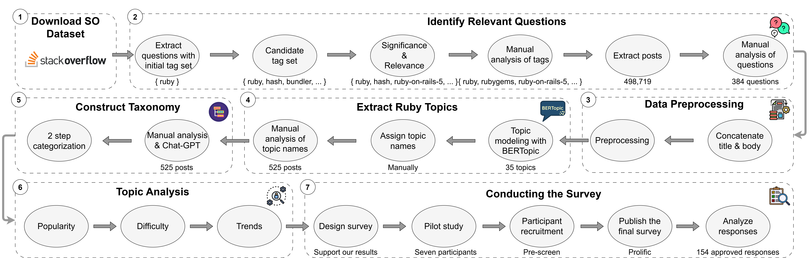

# Unveiling Ruby: A Study of Developer Challenges and Topic Trends

This repository contains code and data for analyzing Ruby-related topics from Stack Overflow and a developer survey. It includes topic modeling, statistical comparisons, survey result processing, and detailed visualizations across different abstraction levels.

---
## 📖 Overview



This project investigates developer challenges with the Ruby programming language by mining Stack Overflow and conducting a complementary developer survey. It applies topic modeling, statistical analysis, and survey alignment to uncover real-world issues and perceptions around Ruby.

---
## 🧪 Key Components

- **Data Preprocessing**: Scripts to collect, clean, and filter Stack Overflow data.
- **Analysis**: Statistical methods to measure topic difficulty, popularity, and developer experience.
- **Visualization**: Publication-quality plots and charts for the paper.
- **Topic Modeling**: BERTopic-based modeling with hyperparameter tuning.
- **Survey Analysis**: Comparison between heuristic data and developer-reported perceptions.

---
## 🧪 Core Scripts & Instructions

### 1. `preprocess.py`
- Adds `CombinedText` = Title + Body
- Removes HTML, code blocks, punctuation, and links
- Saves clean text for topic modeling

### 2. `find_best_model.py`
- Runs BERTopic with SentenceTransformers and HDBSCAN
- Outputs `topic_info1.csv` and coherence scores
- Saves model in `results/model`

### 3. `survey_vs_so_modular.py`
- Loads and analyzes Likert-scale survey data
- Plots dot charts comparing survey difficulty vs SO difficulty
- Computes correlation and paired t-tests

### 4. `heatmap_generation.py`
- Step 1: Heatmap for fine-grained `topic_name`
- Step 2: Heatmap for `middle_category`
- Step 3: Heatmap for `category`
- Output saved as transparent PDFs

### 5. `line_plot_analysis.py`
- Step 1/1-1: Line plots per topic (year/month)
- Step 2: Trends for `middle_category`
- Step 3: Trends for `category` + Mann-Kendall significance test

---
## 📁 Repository Structure

```
.
├── README.md
├── data_preprocessing/                   # Cleans and merges textual data into CombinedText
├── analysis/                             # Analysis for results
├── notebooks/                            # Jupyter Notebooks for BERTopicing
├── utils/                                # Utils
├── visualization/                        # Generating charts and plots
├── results/
│   ├── data/                             # StackOverflow data
│   ├── model/                            # Yearly heatmaps for topics
│   └── survey/                           # Raw survey data
```

---
## 🚀 Getting Started

### 1. Clone the Repository
```bash
git clone https://github.com/niktaakbarpour/unveiling-ruby.git
cd unveiling-ruby
```

### 2. Create Environment and Install Dependencies
```bash
python -m venv venv
source venv/bin/activate    # On Windows use `venv\Scripts\activate`
pip install -r requirements.txt
```

### 3. Run Analyses
```bash
python analysis/calculate_difficulty.py
python visualization/heat_map.py
```

---
## 🛠️ Dependencies

Install all required packages with:

```bash
pip install -r requirements.txt
```

Main dependencies:
- `pandas`, `matplotlib`, `seaborn`, `tqdm`
- `scikit-learn`, `gensim`, `bertopic`, `hdbscan`, `umap-learn`
- `sentence-transformers`, `pymannkendall`, `bs4`

---

## 📈 Sample Outputs

Outputs include:
- Dot charts (survey vs SO difficulty)
- Line plots of yearly/monthly post trends
- Mann-Kendall statistical test results
- Transparent PDF heatmaps for report inclusion

---

## 🗂️ Download Full Data & Figures

To access full-size datasets, survey data, and all visualizations:

📁 **Google Drive Folder**: [Unveiling Ruby Resources](https://drive.google.com/drive/folders/1UcV6DNYqQRRV-zOFmsLRApazoZG8xrq6?usp=sharing)

**Contents:**
- Cleaned survey & Stack Overflow datasets
- All dot charts, line plots, and heatmaps
- Supplementary figures in PNG and PDF format

> **Note:** These files are large and not hosted directly in this repository due to GitHub's file size limits.


---

## 📄 Citation

If you use this work, please cite our paper:

```bibtex
@inproceedings{akbarpour2025unveiling,
  author    = {Nikta Akbarpour and Ahmad Saleem Mirza and Erfan Raoofian and Fatemeh Fard and Gema Rodr{\'i}guez-P\'{e}rez},
  title     = {Unveiling Ruby: Insights from Stack Overflow and Developer Survey},
  booktitle = {Proceedings of the 29th International Conference on Evaluation and Assessment in Software Engineering (EASE)},
  year      = {2025},
  location  = {Istanbul, Türkiye}
}
```

---

For questions, please contact: [niktakbr@student.ubc.ca](mailto:niktakbr@student.ubc.ca)
